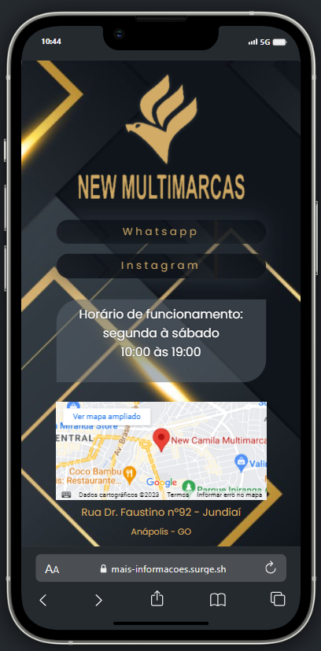

# Projeto de link com utilidades para instagram.

### Disponível apenas para visualização em dispositivos mobile.

[Clique para conferir o site!](https://mais-informacoes.surge.sh/)

[Repositório back-end](https://github.com/Rlopesn/new-multimarcas)

### Detalhes
- Botoões para Whatsapp e instagram.
- Informativo com horário de funcionamento e se loja aberta ou fechada.
- Frame com localização via google maps.

# Pessoa desenvolvedora

### Rafael Lopes Nogueira

